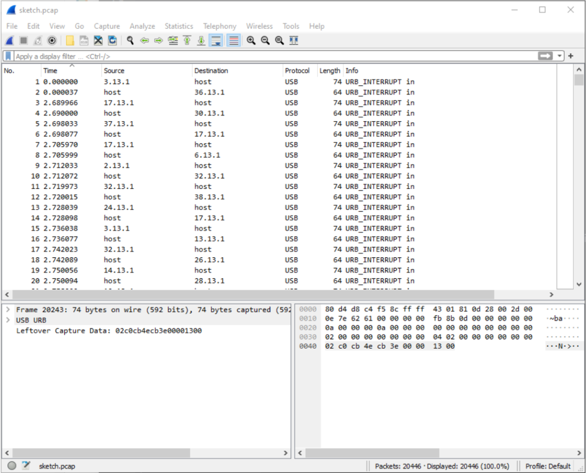
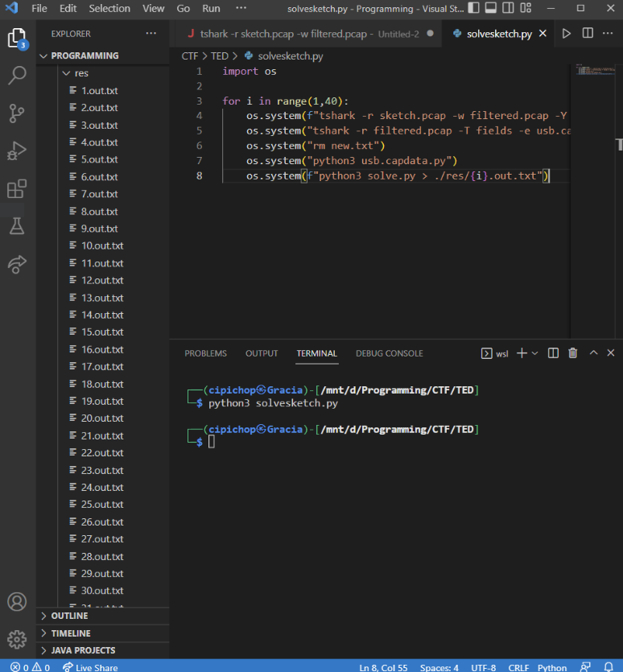
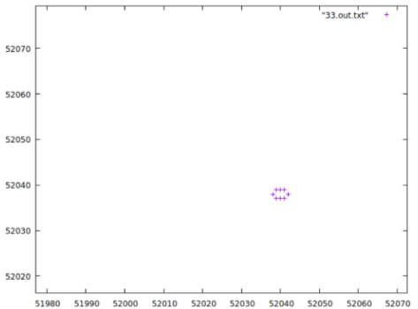
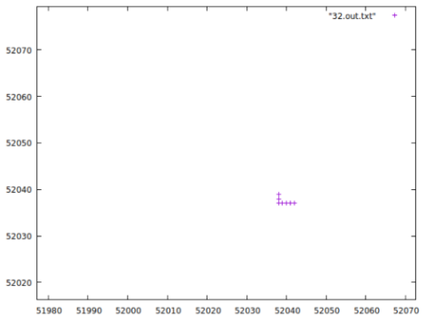
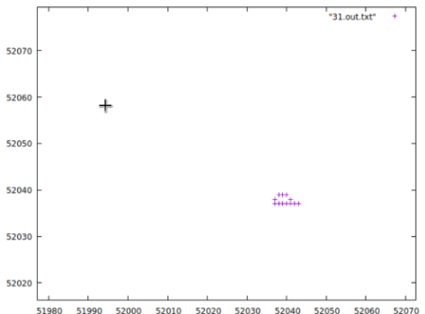

# Sketch

Given a pcap file named sketch.pcap



Based on the provided hint, it is a usb traffic from pentabs, specifically wacom CTL 472. We found a reference https://www.petermstewart.net/otterctf-2018-network-challenges-look-at-me-write-up/ so we tried to extract the traffic into coordinates then plotted them using gnuplot. We repeated this step for every wacom device.

---
solvesketch.py

```py
import os

for i in range(1,40):
    os.system(f"tshark -r sketch.pcap -w filtered.pcap -Y '((usb.transfer_type == 0x01) && (frame.len == 74) && (usb.src == {i}.13.1))'")
    os.system("tshark -r filtered.pcap -T fields -e usb.capdata -Y usb.capdata > usb.capdata.txt")
    os.system("rm new.txt")
    os.system("python3 usb.capdata.py")
    os.system(f"python3 solve.py > ./res/{i}.out.txt")
```

---
usb.capdata.py

```py
f = open("usb.capdata.txt").readlines()
g = open("new.txt","a")
for i in f:
    a = i[4:8]+" "+i[8:12]+" "+i[12:16]+"\n"
    g.write(a)
```

---
solve.py

```py
from pwn import *


for line in open('new.txt').readlines():
  coord = line.strip().split(' ')
  x = int(coord[0],16)
  y = int(coord[1],16)
  z = int(coord[2],16)


  if z > 0:
    print (u16(struct.pack(">H",x)),u16(struct.pack(">H",y)))
```

The result will be like this



Plot one by one using gnuplot will result like this





We wrote the letters one by one and got the flag

```
CTFTED2022{mult1_bus_0n_w4com_protocol}
```