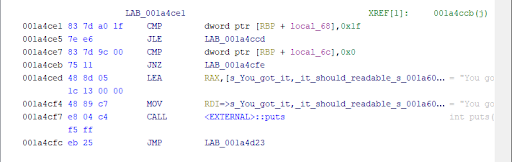
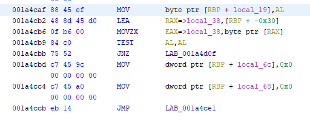
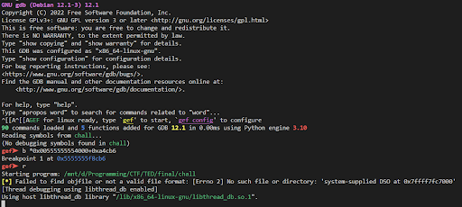
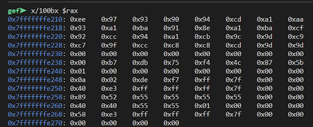
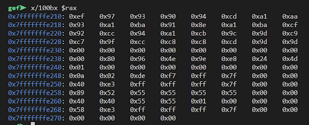
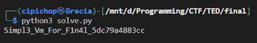

# huff

Given an executable, it cannot be decompiled because the assembly is very large. To figure out where to begin, we first search for the place where the output "You got it" appear, which is in `LAB_001a4ce1`.


`LAB_001a4ce1` is called through the following assembly:


To make `LAB_001a4ce1` is called, the JNZ condition should not be met, then we need to make `AL == 0`.

We perform dynamic analysis to determine the contents of AL.


RAX when we input "A":


RAX when we input "B":


As seen, when the input is increased from "A" to "B", the first byte of RAX also increases from `0xee` to `0xef`. So, we just need to find the offset and keep increasing it until it goes back to `0x00`. Once everything becomes `0x00`, AL will become 0, and that means the string we input is the flag.

```py
flag = ""
flag += chr(ord('A')+(0x100-0xee))
c = [0x97,0x93,0x90,0x94,0xcd,0xa1,0xaa,0x93,0xa1,0xba,0x91,0x8e,0xa1,0xba,0xcf,0x92,0xcc,0x94,0xa1,0xcb,0x9c,0x9d,0xc9,0xc7,0x9f,0xcc,0xc8,0xc8,0xcd,0x9d,0x9d]
for i in c:
    flag += chr(0x100-i)


print(flag)
```


```
CTFTED22{Simpl3_Vm_For_F1n4l_5dc79a4883cc}
```