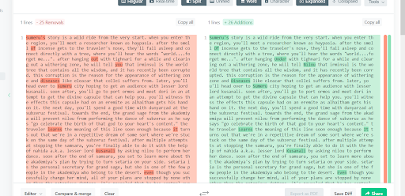

# Truth

Given a PDF with an article that is actually from [here](https://www.thegamer.com/genshin-impact-entire-plot-explained/). Just google a part of the text and you will find that link. 

From the chall description, we are told to "erase the title". I'm not entirely sure what it means, but we are also asked to look for the uppercase letters. So, in the first article, I convert everything to lowercase, then simply use a diff tool to compare it with the text in the PDF. Note every uppercase letter.



Note: actually it doesn't need diff check but just note down every uppercase letter...

```
ARA2023{SOUNDS_LIKE_FANDANGO}
```