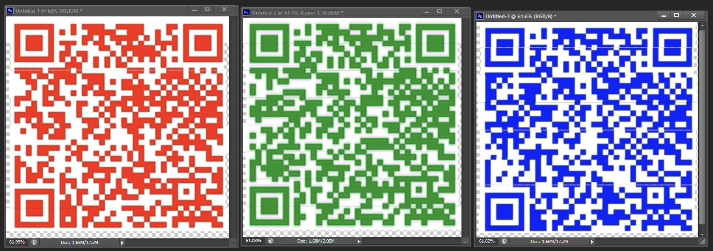
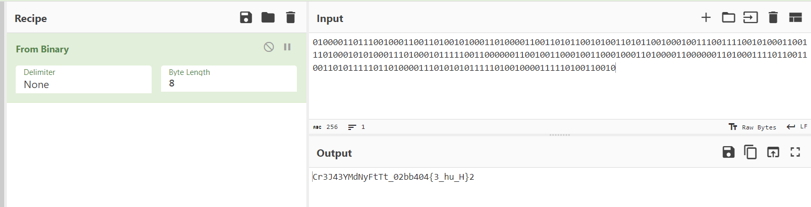

# CustomSteg

A GIF file is given, containing three pieces of a barcode in three different colors. The first step is to try and combine the barcodes using Paint or Photoshop, and then scan them.

Given a GIF file containing 3 parts of each QR code for 3 QR codes in 3 different colors. The first step in to combine the QR codes using Paint or Photoshop (here I used Photoshop because the green one is slightly harder to be scanned).



The red one leads to a gdrive containing a CPP file. The green one leads to a gdrive with a file `image.ppm`. The blue one leads to a gdrive with a file `finalimage.ppm`.

```cpp
#include <iostream>
#include <fstream>
#include <cstdlib>


using namespace std;


void randomize (char flag[], char random[], int size){
    for(int i=0; i<size; i++){
        random[i]=i;
    }
    for (unsigned i = 0; i < size; ++i) {
        unsigned j = rand() % (size+1);
        char tmp = random[j];
        random[j] = random[i];
        random[i] = tmp;
    }
    int i=0;
    while(i<size){
        int tempi = random[i];
        char temp = flag[i];
        flag[i]=flag[tempi];
        flag[tempi]=temp;
        i++;
    }
}


void conbinary (char flag[], int flagnew[], int size, int sizebin){
    int c, k=0;
    for(int i=0; i<size; i++){
        c = flag[i];
        if(c!=' '){
            for(int j=7; j+1>0; j--){
                if(c>=(1<<j)){
                    c=c-(1<<j);
                    flagnew[k]=1;
                    k++;
                }else{
                    flagnew[k]=0;
                    k++;
                }
            }
        }
    }
}


int getMax (int redvalues[], int ind, int indnew){
    int max=0;
    for(int i=ind; i<ind+8;i++){
        if(max<redvalues[i]){
            max = redvalues[i];
            indnew = i;
        }
    }
    return indnew;
}


void encode (int bluevalues[], int redvalues[],int flagnew[], int sizebin){
    ifstream image;
    ofstream newimage;
    image.open("image.ppm");
    newimage.open("newimage.ppm");


    string type = "";
    int width = 0, height = 0, RGB =0;
    image >> type;
    image >> width;
    image >> height;
    image >> RGB;
   
    newimage << type << endl;
    newimage << width << " " << height << endl;
    newimage << RGB << endl;
   
    int red = 0, green = 0, blue = 0;
    int i = 0, j = 0, ind=0,indnew=0;


    while(!image.eof()){
        image >> red;
        image >> green;
        image >> blue;
        if(i%8==0 && j<sizebin){
            indnew = getMax(redvalues, ind, indnew);
        }
        if(i == indnew && j<sizebin){
            newimage<< redvalues[i]/2 << " " << green << " " << bluevalues[i]+flagnew[j] << " ";
            j++;


        }
        else {
            newimage<< red*2 << " " << green << " " << blue << " ";
        }
        i++;
        ind++;
    }


    image.close();
    newimage.close();
}


void getRedBlue(int redvalues[], int bluevalues[]){
    ifstream image;
    image.open("image.ppm");


    string type = "";
    int width = 0, height = 0, RGB =0;
    image >> type;
    image >> width;
    image >> height;
    image >> RGB;


    int red = 0, green = 0, blue = 0;
    int i=0;


    while(!image.eof()){


        image >> red;
        image >> green;
        image >> blue;


        redvalues[i]=red;
        bluevalues[i]=blue;
        i++;
    }
   
    image.close();
}


void filter(int keyval){
    ifstream newimage;
    ofstream finalimage;
    newimage.open("newimage.ppm");
    finalimage.open("finalimage.ppm");


    string type = "";
    int width = 0, height = 0, RGB =0;
    newimage >> type;
    newimage >> width;
    newimage >> height;
    newimage >> RGB;
   
    finalimage << type << endl;
    finalimage << width << " " << height << endl;
    finalimage << RGB << endl;
   
    int red = 0, green = 0, blue = 0;


    while(!newimage.eof()){
        newimage >> green;
        newimage >> blue;
        newimage >> red;
        if(green + keyval >= 255){
            green = 255;
        }
        else {
            green += keyval;
        }
        finalimage<< red << " " << green << " "<< blue<< " ";
    }


    newimage.close();
    finalimage.close();


}


int main(){
    char flag[]="REDACTED";
    int size = (sizeof(flag)/sizeof(flag[0]))-1;
    int sizebin = size*8;
    char random[size];
    int flagnew[sizebin];


    randomize(flag,random,size);
    conbinary(flag,flagnew,size,sizebin);


    ifstream image;
    image.open("image.ppm");
    string type = "";
    int width = 0, height = 0;
    image >> type;
    image >> width;
    image >> height;
    image.close();


    int redvalues[width*height];
    int bluevalues[width*height];
   
    getRedBlue(redvalues,bluevalues);
    encode(bluevalues, redvalues, flagnew, sizebin);
    filter(20);
   


    return 0;
}
```

Code cpp ini intinya pertama nge-shuffle flag nya dengan swap menggunakan index random, lalu tiap 8 pixel diambil value dari warna merah yang terbesar, lalu disisipkan 1 bit dari flag di value warna biru, lalu di pixel itu value merah nya jadi setengahnya doang. Kalau bukan yang terbesar valuenya dikali dua. Lalu terakhir difilter lagi, diambil value warnanya agak teracak, biasanya RGB tapi ini GBR, lalu si value warna hijau ini ditambahkan 20 (max 255), lalu ditaruh di file finalimage berurut RGB lagi.
Cara solvenya kami reverse aja.

The point is this CPP code first shuffle the flag by swapping using random indexes, then for every 8 pixels, take the largest value of the red color, and insert 1 bit from the flag into the blue color value, then the red color value of that pixel is halved. If it's not the largest value, the value is multiplied by two. Then lastly, the image is filtered again by taking the color values in a slightly scrambled order, where usually it's RGB, but here it’s GBR. Then, the green color value is increased by 20 (max 255), and it’s placed back into the final image in RGB order.

The solution method is simply to reverse the process.

```cpp
#include <iostream>
#include <fstream>
#include <cstdlib>


using namespace std;


void defilter(int keyval)
{
    ifstream newimage;
    ofstream finalimage;
    newimage.open("finalimage.ppm");
    finalimage.open("newimage.ppm");


    string type = "";
    int width = 0, height = 0, RGB = 0;
    newimage >> type;
    newimage >> width;
    newimage >> height;
    newimage >> RGB;


    finalimage << type << endl;
    finalimage << width << " " << height << endl;
    finalimage << RGB << endl;


    int red = 0, green = 0, blue = 0;


    while (!newimage.eof())
    {
        newimage >> red;
        newimage >> green;
        newimage >> blue;
        green -= keyval;
        finalimage << green << " " << blue << " " << red << " ";
    }


    newimage.close();
    finalimage.close();
}


int getMax(int redvalues[], int ind, int indnew)
{
    int max = 0;
    for (int i = ind; i < ind + 8; i++)
    {
        if (max < redvalues[i])
        {
            max = redvalues[i];
            indnew = i;
        }
    }
    return indnew;
}


void decode(int redvalues[], int bluevalues[])
{
    ifstream image;
    ifstream newimage;
    ofstream finalimage;
    image.open("image.ppm");
    newimage.open("newimage.ppm");


    string type = "";
    int width = 0, height = 0, RGB = 0;
    image >> type;
    image >> width;
    image >> height;
    image >> RGB;


    int red = 0, green = 0, blue = 0;
    int red2 = 0, green2 = 0, blue2 = 0;
    int i = 0, j = 0, ind = 0, indnew = 0;
    while (!image.eof())
    {
        image >> red;
        image >> green;
        image >> blue;
        newimage >> red2;
        newimage >> green2;
        newimage >> blue2;
        if (i % 8 == 0 )
        {
            indnew = getMax(redvalues, ind, indnew);
        }
        if (i == indnew)
        {
            cout << blue2-blue;
        }
        i++;
        ind++;
    }


    newimage.close();
}


void getRedBlue(int redvalues[], int bluevalues[]){
    ifstream image;
    image.open("image.ppm");


    string type = "";
    int width = 0, height = 0, RGB =0;
    image >> type;
    image >> width;
    image >> height;
    image >> RGB;


    int red = 0, green = 0, blue = 0;
    int i=0;


    while(!image.eof()){


        image >> red;
        image >> green;
        image >> blue;


        redvalues[i]=red;
        bluevalues[i]=blue;
        i++;
    }
   
    image.close();
}


int main()
{
    ifstream image;
    image.open("image.ppm");
    string type = "";
    int width = 0, height = 0;
    image >> type;
    image >> width;
    image >> height;
    image.close();


    int redvalues[width * height];
    int bluevalues[width * height];


    getRedBlue(redvalues, bluevalues);
    defilter(20);
    decode(redvalues, bluevalues);
}
```

First, the image is defiltered, and then decoded. First I found the indexes were used to insert the LSB (Least Significant Bit). After that, compare the blue channel values between the final image and the original one, and subtract them. The result will be as follows.

```
01000011011100100011001101001010001101000011001101011001010011010110010001001110011110010100011001110100010101000111010001011111001100000011001001100010011000100011010000110000001101000111101100110011010111110110100001110101010111110100100001111101001100100000000000000000000000000000000000000000000000000000000000000000000000000000000000000000000000000000000000000000000000000000000000000000000000000000000000000000000000000000000000000000000000000000000000000000000000000000000000000000000000000000000000000000000...
```

Let's decode it using cyberchef.



Yay now I have the shuffled flag, I just need to re-shuffle it. Since the CPP rand() function always gives the same result even without a seed, we can create the solver.

```cpp
#include <bits/stdc++.h>
using namespace std;


void derandomize (char flag[], int size){
    char random[size];
    for(int i = 0; i < size; i++){
        random[i]=i;
    }
    for (unsigned i = 0; i < size; i++) {
        unsigned j = rand() % (size+1);
        char tmp = random[j];
        random[j] = random[i];
        random[i] = tmp;
    }
    for(int i = size-1; i >= 0; i--){
        int tempi = random[i];
        char temp = flag[i];
        flag[i]=flag[tempi];
        flag[tempi]=temp;
    }
}


int main(){
    char flag[] = "Cr3J43YMdNyFtTt_02bb404{3_hu_H}2";
    int size = (sizeof(flag)/sizeof(flag[0]))-1;
    cout << size << endl;
    derandomize(flag, size);
    cout << flag;  
}
```

If I run the code on Linux, it will be messy, but if I run it on Windows, it will give the flag.

```
JCTF2023{M4yb3_N0t_H4rd_butY34h}
```