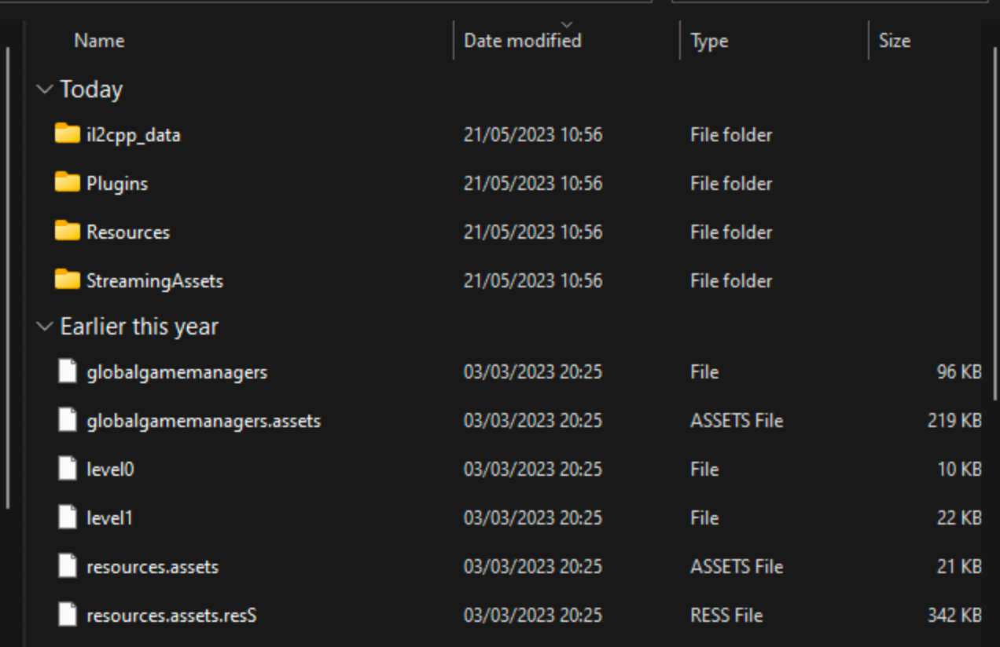

# Impossible Game

Given a game setup, and the game is based on Unity. The win condition of this game is to defeat the boss until its health reaches 0.


Since the boss's health is way too high, the game needs to be patched.



After analyzing the game files, we found that there is no `Assembly-CSharp.dll`, and there is a directory named `il2cpp_data`, which means the game has been compiled into C++ so that the source code cannot be decompiled.

We tried dumping `GameAssembly.dll` and `global-metadata.dat` on https://il2cppdumper.com/the-dumper-tool. After opening the `DummyDll` folder, it was empty, and we realized there was an obfuscate function that obfuscates the global-metadata.dat file.

So, we changed our method and debug the game using Cheat Engine.

When the game is running, we pause it, then input the boss's health value in Cheat Engine and scan it. After finding the value, we change it to a number close to 0, then kill the boss.

After that, a popup appeared stating that the flag is being processed because we accessed the memory of the boss's health variable. After some time searching, we found the flag.


```
JCTF2023{c0ngrat5_m0dd3r!_1ts_ju5t_4m0d_&_s0me_r3v_4ft3r_4ll}
```