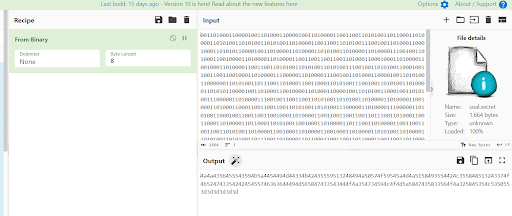
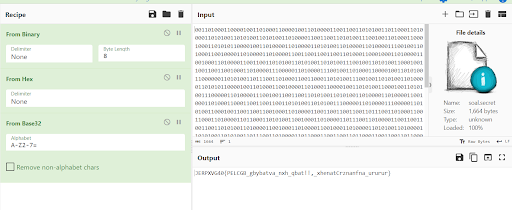
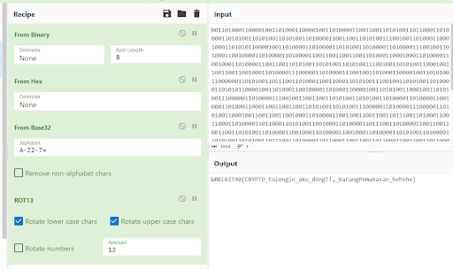

# CRYPTO Free Flag

Given a file soal.secret that contains 0 and 1. Here is the binary decoded result.



Turns out there is another encoding. Thanks to CyberChef magic wand and it decode from hex.



The result looks like a flag, but not in the right format. Time to ROT13.



```
WRECKIT40{CRYPTO_tolongin_aku_dong!!,_kurangPemanasan_hehehe}
```