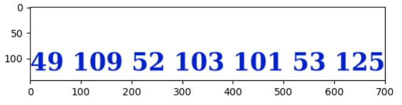

# Thinker

Given a file `confused.png`. Checking it with pngcheck yield this result
```
└─$ pngcheck confused.png
zlib warning:  different version (expected 1.2.13, using 1.3.1)

confused.png  additional data after IEND chunk
ERROR: confused.png
```

Next, checking it with binwalk yield this result
```
└─$ binwalk -e confused.png

DECIMAL       HEXADECIMAL     DESCRIPTION
--------------------------------------------------------------------------------
0             0x0             PNG image, 720 x 881, 8-bit/color RGB, non-interlaced
6170          0x181A          Zlib compressed data, best compression
321663        0x4E87F         TIFF image data, big-endian, offset of first image directory: 8
321693        0x4E89D         Zip archive data, at least v1.0 to extract, name: didyou/
321758        0x4E8DE         Zip archive data, at least v1.0 to extract, compressed size: 13, uncompressed size: 13, name: didyou/e.txt
321841        0x4E931         Zip archive data, at least v1.0 to extract, compressed size: 10568, uncompressed size: 10568, name: didyou/find.zip
332460        0x512AC         End of Zip archive, footer length: 22
332726        0x513B6         End of Zip archive, footer length: 22
```

Inside didyou/ directory, we can find a zip file `find.zip` and a text file name `e.txt` with a base64 string `QVJBMjAyM3s=`, which can be decoded into `ARA2023{`.

Unzip and go to find/ directory, we can find a zip file `something.zip` and a text file name `a.txt` with hex value `35216D706C335F`, which can be decoded into `5!mpl3_`.

Unzip and go to something/ directory, we can find another zip file `suspicious.zip` and a text file `s.txt` with binary value `01000011 00110000 01110010 01110010 01110101 01110000 01110100 00110011 01100100 01011111` which can be decoded into `C0rrupt3d_`.

Unzip and go to suspicious/ directory, we can find a PNG file `y.png`. Apparently, it has no signature and IHDR, just IDAT. Solving this PNG problem using the same way as in [Warm Up/PNG Hell](../../Warm%20Up/PNG%20Hell/README.md) to bruteforcing the size.

```
403920
144 701
272 371
528 191
720 140
```

The most promising size is 720 and 140. But it didn't work lmao. Turns out that the right size is 144 401.
 
The result is some decimal, which decoded into `1m4ge5}`



```
ARA2023{5!mpl3_C0rrupt3d_1m4ge5}
```