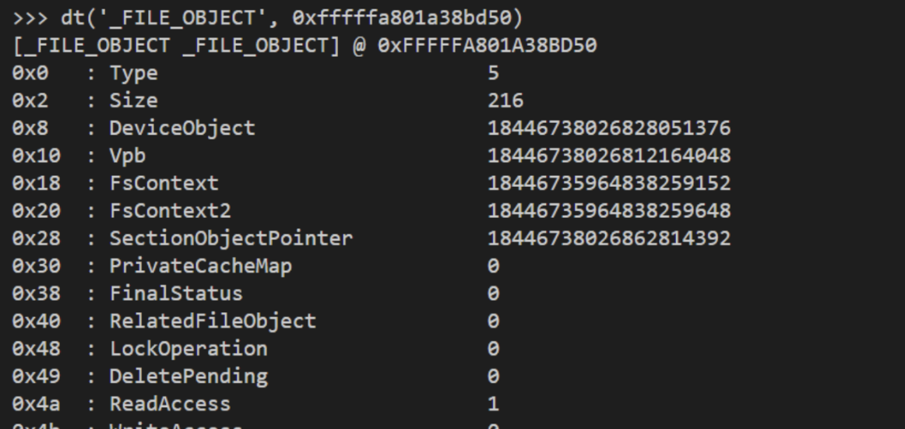

# Kernelmania

*Objective: What is the offset when the malware file is opened?*

Given a .vmem file, using volatility2 we ran imageinfo plugin to get the profile image.

Once we get the image profile, proceed to the next step is to run filescan plugin and we found `malware.exe` at PID 2704. I tried to dump the malware at that PID, and it gives me the offset below

```
└─$ python2.7 ../volatility/vol.py -f ARA_VM_Malicious-54b9c9e7.vmem --profile=Win7SP1x64 dumpfiles -p 2704 -D .
Volatility Foundation Volatility Framework 2.6.1
ImageSectionObject 0xfffffa801a38bd50   2704   \Device\HarddiskVolume2\Users\araseng\Desktop\malware.exe
DataSectionObject 0xfffffa801a38bd50   2704   \Device\HarddiskVolume2\Users\araseng\Desktop\malware.exe
DataSectionObject 0xfffffa801b231dd0   2704   \Device\HarddiskVolume2\Windows\System32\locale.nls
ImageSectionObject 0xfffffa8019d4d880   2704   \Device\HarddiskVolume2\Windows\System32\ntdll.dll
...
```

Lets keep it for later.

Based on the volatility documentation, in volshell, we can use dt (display_type) to give type name or interpret data in the process. Then, we bumped into this article https://learn.microsoft.com/en-us/windows-hardware/drivers/ddi/wdm/ns-wdm-_file_object.

> The FILE_OBJECT structure is used by the system to represent a file object. To user-mode protected subsystems, a file object represents an open instance of a file, device, directory, or volume.

More over, this part

> `DeviceObject`
>
> A pointer to the device object on which the file is opened.

That being said, we go to volshell and run `dt(‘_FILE_OBJECT’, 0xfffffa801a38bd50)`



We took the offset from DeviceObject `18446738026828051376` and convert it to hex `0xfffffa8019c6b3b0`

```
ARA2023{0xfffffa8019c6b3b0}
```