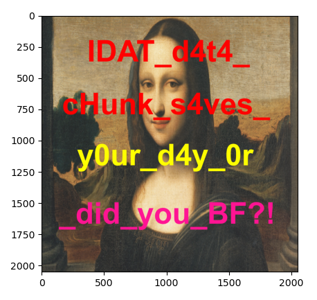

# PNG Hell

Given `monalisa_is_missing.png.enc` file and `picturial_art.py` code below

```py
from Crypto.Util.number import *
import os,random,struct
import sys

def parse_header(x):
	assert x[1:4] == b'PNG'
	signature = x[:16]
	w = struct.unpack(">I",x[16:20])[0]
	h = struct.unpack(">I",x[20:24])[0]
	crc = struct.unpack(">I", x[29:33])[0]
	new_crc = w * h * crc
	obj = random.SystemRandom()
	initial_seed = os.urandom(4)
	random.seed(obj.randrange(bytes_to_long(initial_seed)))
	new_w,new_h,new_crc = os.urandom(4),os.urandom(4),(new_crc * w * h * random.getrandbits(32))&0xffffffff
	return signature, new_w, new_h,new_crc

def traverse(x):
	count=0
	while b'IDAT' not in x[count+33:count+37]:
		count+=1
	random_data = os.urandom(count)
	return random_data,count

def transform(x):
	buf = open(x,"rb").read()
	sig, w, h, crc = parse_header(buf)
	assert len(w) == 4
	assert len(h) == 4
	assert len(struct.pack(">I",crc)) == 4
	xormask, count = traverse(buf)
	newbuf = ""
	for i in range(count):
		newbuf += chr((buf[33+i] ^ xormask[i])&0xff)
	rest = buf[count:-1]
	newbuffer = sig + w + h + struct.pack('>I',crc)+newbuf.encode()+rest
	with open(x+".enc","wb") as ff:
		ff.write(newbuffer)
		ff.close()
	print("[+] DONE!")
	os.remove(x)


print("Picturial Art v13.37\n================\n\nYour Fancy Image Beautifier")
img = input("Please input your image name (in the current directory) and we'll beautify it for you! :")
print("Thankyou we'll process your image!")
transform(img)
print("Done! But you got fooled. You lost your precious image ^-^")
```

The code is basically corrupting the PNG header only. The PNG data is safe and can be reconstructed.

Checking the corrupted PNG file using pngcheck yield this result

```
└─$ pngcheck monalisa_is_missing.png.enc 
zlib warning:  different version (expected 1.2.13, using 1.3.1)

monalisa_is_missing.png.enc  invalid IHDR sample depth (83)
monalisa_is_missing.png.enc  private (invalid?) IHDR compression method (205) (warning)
monalisa_is_missing.png.enc  private (invalid?) IHDR filter method (192) (warning)
monalisa_is_missing.png.enc  invalid IHDR interlace method (51)
ERROR: monalisa_is_missing.png.enc
```

Yup, it's confirming the above code.

The provided hint was telling us to check this blog https://pyokagan.name/blog/2019-10-14-png/.

Since we don't need the broken header anymore, we can skip the header processing and get straight into IDAT chunk processing that stores the PNG data.

```py
import zlib
import struct

f = open('monalisa_is_missing.png.enc', 'rb').read()
count = f.find(b"IDAT")-4

f = open('monalisa_is_missing.png.enc', 'rb')

def read_chunk(f):
    # Returns (chunk_type, chunk_data)
    chunk_length, chunk_type = struct.unpack('>I4s', f.read(8))
    chunk_data = f.read(chunk_length)
    chunk_expected_crc, = struct.unpack('>I', f.read(4))
    chunk_actual_crc = zlib.crc32(chunk_data, zlib.crc32(struct.pack('>4s', chunk_type)))
    if chunk_expected_crc != chunk_actual_crc:
        raise Exception('chunk checksum failed')
    return chunk_type, chunk_data

f.read(count)
chunks = []

while True:
    try:
        chunk_type, chunk_data = read_chunk(f)
        chunks.append((chunk_type, chunk_data))
        if chunk_type == b'IEND':
            break
    except:
        break

print([a[0] for a in chunks])

IDAT_data = b''.join(chunk_data for chunk_type, chunk_data in chunks if chunk_type == b'IDAT')
IDAT_data = zlib.decompress(IDAT_data)

print(len(IDAT_data))

width = 2050
height = 2050

def PaethPredictor(a, b, c):
    p = a + b - c
    pa = abs(p - a)
    pb = abs(p - b)
    pc = abs(p - c)
    if pa <= pb and pa <= pc:
        Pr = a
    elif pb <= pc:
        Pr = b
    else:
        Pr = c
    return Pr

Recon = []
bytesPerPixel = 4
stride = width * bytesPerPixel

def Recon_a(r, c):
    return Recon[r * stride + c - bytesPerPixel] if c >= bytesPerPixel else 0

def Recon_b(r, c):
    return Recon[(r-1) * stride + c] if r > 0 else 0

def Recon_c(r, c):
    return Recon[(r-1) * stride + c - bytesPerPixel] if r > 0 and c >= bytesPerPixel else 0

i = 0
for r in range(height): # for each scanline
    print(r)
    filter_type = IDAT_data[i] # first byte of scanline is filter type
    i += 1
    for c in range(stride): # for each byte in scanline
        Filt_x = IDAT_data[i]
        i += 1
        if filter_type == 0: # None
            Recon_x = Filt_x
        elif filter_type == 1: # Sub
            Recon_x = Filt_x + Recon_a(r, c)
        elif filter_type == 2: # Up
            Recon_x = Filt_x + Recon_b(r, c)
        elif filter_type == 3: # Average
            Recon_x = Filt_x + (Recon_a(r, c) + Recon_b(r, c)) // 2
        elif filter_type == 4: # Paeth
            Recon_x = Filt_x + PaethPredictor(Recon_a(r, c), Recon_b(r, c), Recon_c(r, c))
        else:
            raise Exception('unknown filter type: ' + str(filter_type))
        Recon.append(Recon_x & 0xff) # truncation to byte

import matplotlib.pyplot as plt
import numpy as np
plt.imshow(np.array(Recon).reshape((height, width, 4)))
plt.show()
```

Basically, IDAT chunk in PNG file is just RGB value data of an image that is compressed using zlib. The code above is recalculating and bruteforcing the image size based on the IDAT data length, then decompressing the data and plot the RGB value using matplotlib.

Honorable mention to this ["Hello, PNG!" blog](https://www.da.vidbuchanan.co.uk/blog/hello-png.html) that explaining PNG from the scratch.



ARA2023{IDAT_d4t4_cHunk_s4ves_y0ur_d4y_0r_did_you_BF?!}