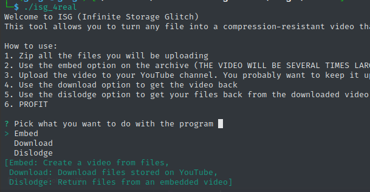
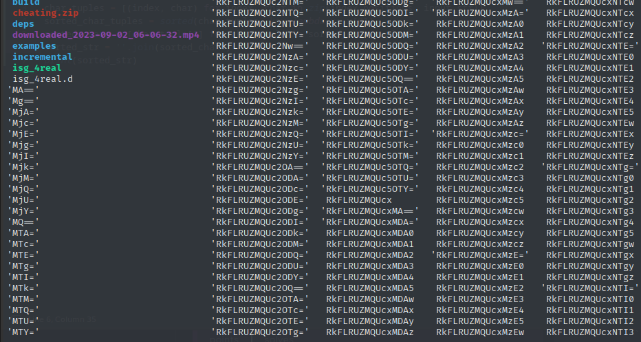
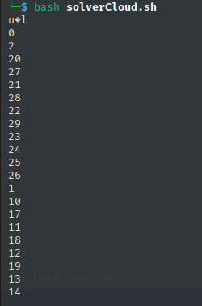

# cloud cheating

Given a youtube video link https://www.youtube.com/watch?v=aR2iuxfJMOE&feature=youtu.be with a very interesting content.

This is an Infinite Storage Glitch that stores file within a youtube video. Our reference is from this GitHub repo https://github.com/DvorakDwarf/Infinite-Storage-Glitch.

Install the tools, build it, then download the youtube video using `isg_4real`. After that, choose "Dislodge" to see the content of the video.



Unzip it and got this files. ALl files start with "RkFL..." is all "FAKEFLAG" thingy. Let's just ignore them (or delete them). There are base64 named files with a character in each file.



`CM_iENZ1_1nFO{_s30zo_EzPt43g_E5t0rF_}Gl1TcHSET15`

If we decode the base64 file name, it is some kind of index of the character. Here we wrote a simple bash script to decode it all,



and a simple python script to sort the content.

```
COMPFEST15{s0o_Ez_3z_EZ_1nFiN1t3_5t0r4gE_Gl1TcH}
```