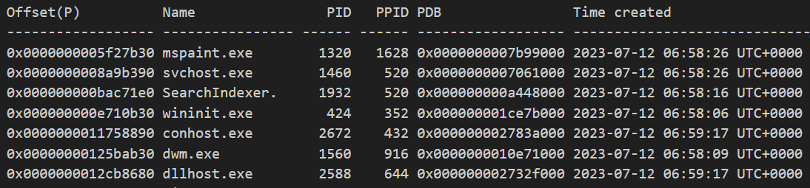
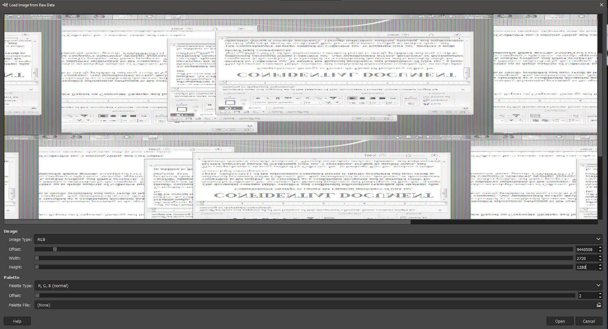

# industrialspy

Given a file `lyubov_20230712.mem`. First thing first, analyzing the memory dump using volatility2, with `psscan` plugin.



As we can see, there is `mspaint.exe`. This is getting interesting because the description mentions about graphic designer. But we are looking for evidence about "stealing confidential documents", I ran `filescan` plugin but didn't find anything useful. Then, I ran `iehistory` and found something interesting.


But yet, the file path couldn't be found in previous `filescan` result.

Anyways, the hint was released:
>Someone is using mspaint.exe for graphic design? That's definitely the intern

So it is really the mspaint process I need to look at. I ran memdump plugin at PID 1320, and then I opened the raw data using GIMP with the width 2720 and the height 1280.



Flip and rotate it


Turns out using width 1020 gives you a very clear output.


vs


```
COMPFEST15{m0D3rn_D4y_5p1es_cb06cc3651}
```