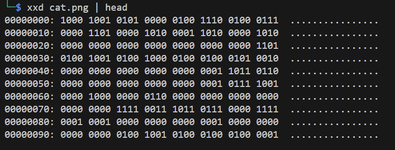
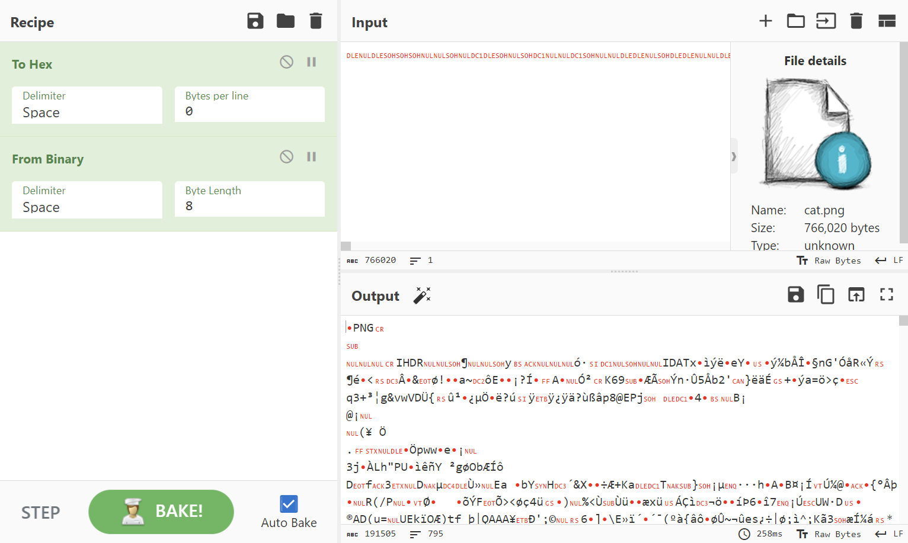
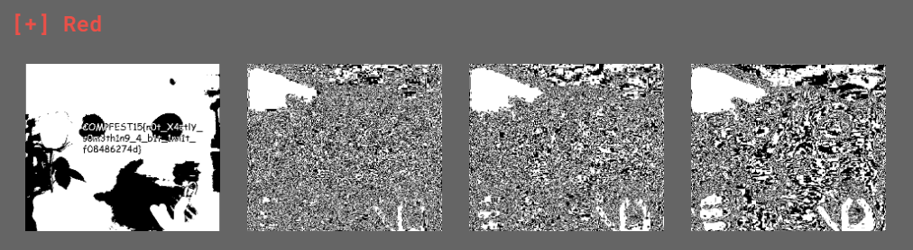

# not simply corrupted

Given a file `cat.png`. First, I ran `xxd cat.png | head` and got this binary in hex.



Go to cyberchef, encode to hex then decode to binary, and I got a PNG file. 




Assumpting this as a steganography chall, I upload the image to AperiSolve.



```
COMPFEST15{n0t_X4ctlY_s0m3th1n9_4_b1t_1nn1t_f08486274d}
```