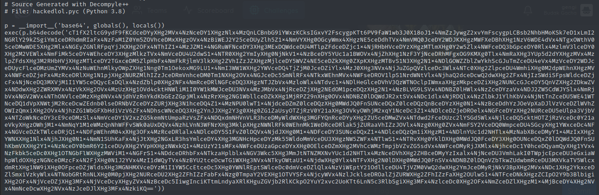
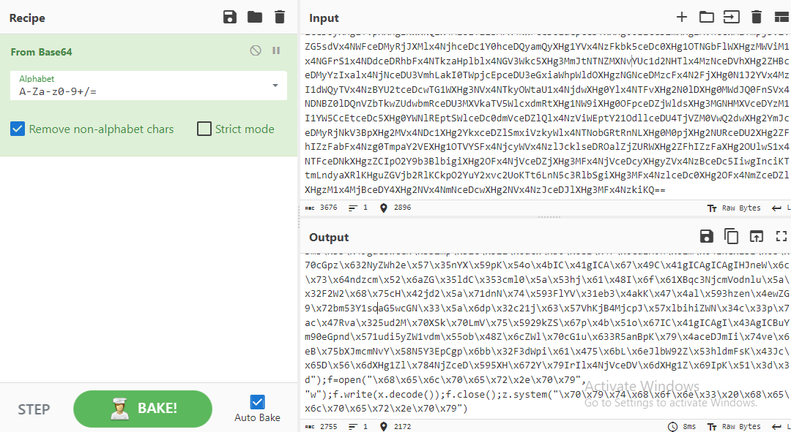

# hackedlol

Given 2 files `file.pyc` and `file.hackedlol`. Decompile the pyc using pycdc.



There is a string encoded with base64. Decode it to get python code that create a new file then delete itself right after it runs.



We copied the output until it reached `f.close()` so it wouldn't delete the file. Run the code and it will drop `helper.py`.

The `helper.py` is obfuscated with unclear variable names and strings. But if we analyze carefuly, we found that the script searches for files with extensions other than `.py`, renames them to `.hackedlol`, then XOR the content using the `helper.py` source code itself as the key. 

So we made a script that uses the same encryption algorithm, stored the original `helper.py` as the key, ran and got the flag. The flag is in `important_file.hackedlol`.

```py
os1=__import__('os', __builtins__.__dict__['globals'](),  __builtins__.__dict__['locals']()),  __builtins__.__dict__['locals']() help=open("helper.py").read() for i, j, k in os1.walk(os1.getcwd()): 
for shit in k: if not shit.endswith(".py"): reader=open(shit, "rb").read() writer=open((shit.rsplit(".", 1)[0])+".hackedlol", "wb") for cnt in range(len(reader)): writer.write(chr(reader[cnt]^ord(help[(cnt*0x27)%len(help)])).encode())
```

```
COMPFEST15{b1G_brr41nz_us1ng_c0d3_4s_k3y_8d7113ecc1}
```