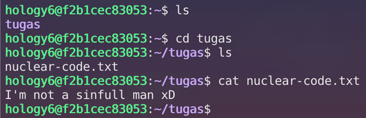
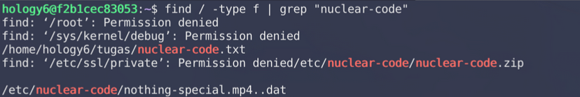
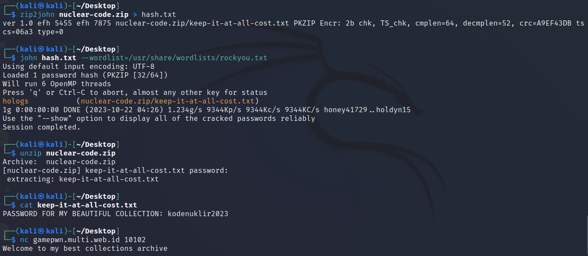
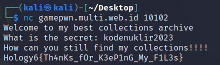

# Nuclear Code

Given a file id_rsa.zip and the SSH address.

In home directory, it has `tugas` directory but nothing useful there.



We ran dommand `find` to see all files for any nuclear code.



The `nothing-special.mp4..dat` is literally nothing special. We tried to take the `nuclear-code.zip` to our host machine using `scp`.

It is a password protected zip, so we bruteforce using John the Ripper and the password is `hologs`. 




```
Hology6{Th4nKs_fOr_K3eP1nG_My_F1L3s}
```