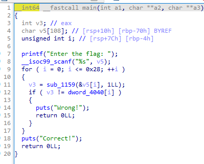
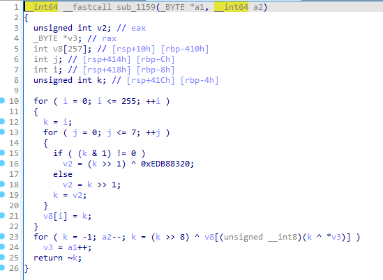
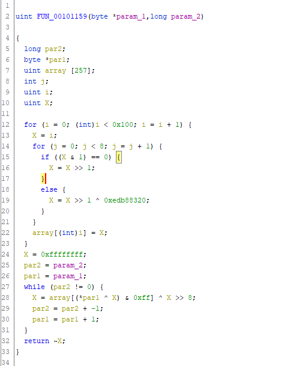
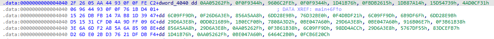

# BF

Given an executable `main`. Decompile using IDA:




Using Ghidra:



I can understand better using Ghidra for function 1159.

So, for the first `for` loop, the point is it runs from 0-255, and for each iteration it loops 8x. If the current iteration is odd, shift by 1 and XOR with `0xedb88320`. If it is even, it will just be shifted. The `while` loop below will only run once. And finally it will return `~X` (not X) and checks whether it matches the value in `dword_4040`. Oh the `0xffffffff` is -1, not 4294967295. Took me an hour to realize that lmao.



```py
data4040 = ['0x0aa05262f', '0x0f0f9344', ..., '0x0fcb6e20c']
arr = []
for i in range(256):
    x = i
    for j in range(8):
        if x & 1 == 0:
            x = x >> 1
        else:
            x = (x >> 1) ^ 0xedb88320
    arr.append(x)

bf = []
for i in range(33, 127):
    x = -1
    x = arr[(i ^ x) % 256] ^ (x >> 8)
    bf.append([str(hex(~x))[2:], chr(i)])

flag = ''
for i in data4040:
    for j in bf:
        if j[0][2:] in i:
            flag += j[1]

print(flag)
```

The first result is kinda odd, where `0x0aa05262f` should be 'H', but I got `5505262f`. So I removed the 2 starting bytes (`if j[0][2:] in i`) and got the flag.

```
Hology6{Brut3f0rc3_IsnT_Th4t_H4rd_R1gHT?}
```