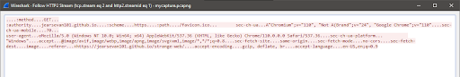
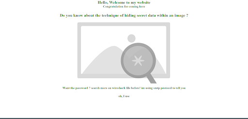
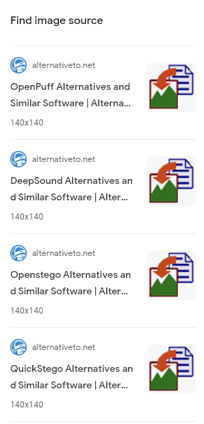
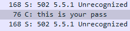
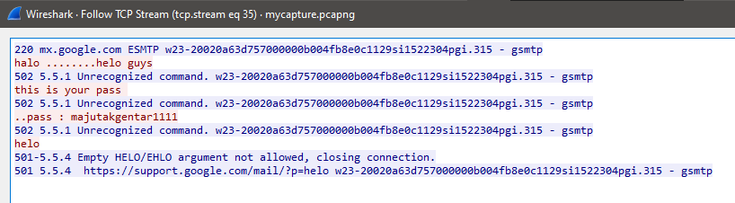
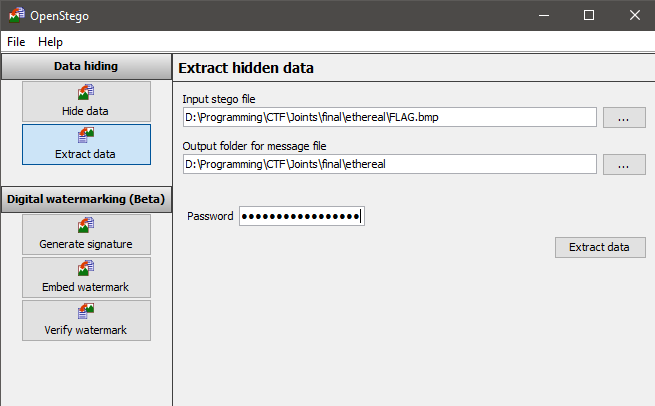

# Ethereal

Given a pcapng file and an sslkeylogfile. First, import the sslkeylogfile into Preferences > Protocol > TLS, then I can start some analysis. I found HTTP2 protocol in frame 103. And if you follow the HTTP/2 stream, you will find the website visited by Jota: https://jearsevan101.github.io/strange-web/.

 

On this website, there is a BMP image that seems to have something hidden inside it. We are given a clue that the password can be found in Wireshark in the SMTP protocol, and there is a suspicious phrase "oh, I use"...

When looking at the source code, there is a PNG image file.


If you search it with Google Lens, it turns out to be the logo of several steganography tools.



Then go back to wireshark to look for SMTP protocol, found at frame 1990 "this is your pass"



Follow TCP stream and got the password is `majutakgentar1111`



Then using the tools openstego, I open the BMP image with the obtained password.



The extracted file is `flag.txt`

```
JCTF2023{w1r3Sh4rk_S0o_Go0d_R1ght?}
```