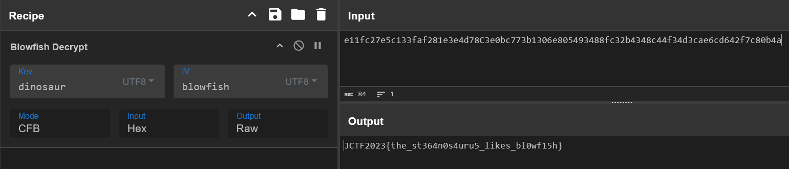

# Dinosaur

### Description
> The stegosaurus is one of the few creatures that likes to eat blowfish. The key of its favorable taste to a blowfish is dinosaur. It initializes his day by using blowfish. Although it wasn't the best food of the prehistoric era, the stegosaurus always leaves a FeedBack which until now, is still a Cipher for historians to crack. No phrases were used by historians to describe the extinct dinosaur.
> 
> By the way, stegosaurus likes to hide. Stegosaurus... hide?

---
From the given description, I ran steghide to check hidden data.

```
└─$ steghide --info stegosaurus.jpg
"stegosaurus.jpg":
  format: jpeg
  capacity: 13.3 KB
Try to get information about embedded data ? (y/n) y
Enter passphrase:
  embedded file "insides_of_stegosaurus.txt":
    size: 84.0 Byte
    encrypted: rijndael-128, cbc
    compressed: yes
```

We know that the key is "dinosaur", the IV is "blowfish", and the mode is CFB. Let's go straight to extract it.



```
JCTF2023{the_st364n0s4uru5_likes_bl0wf15h}
```