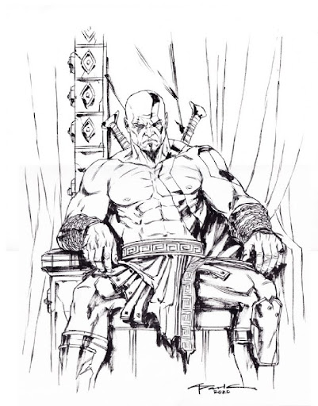
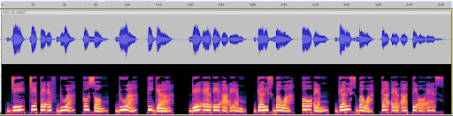

# Spartan Ghosts

Given a disk file `spartan_disk`. According to the description, this file must be XORed. When I ran `cat` command, I got `godofwargodofwargodofwargodofwargodofwargodofwar…` so I tried to XOR it with "godofwar" and it became an ISO file.

After I mounted it, there are audio file `cries_of_sparta`, an image file `savior`, and a plaintext file `history`. 

Here is the history file.
>Perched upon a hill so high,
>Above a village peaceful and still,
>Unleashed a force that made all cry,
>Laying waste to homes and fields at will.
>
>Screeches of pain, a deafening sound,
>Tortured souls and broken dreams,
>Ravaging through with no remorse found,
>Eclipsing all that was serene.
>
>The red sky was his sign of dread,
>Conjuring death from his fiery shell,
>Heralding destruction with every breath,
>Every breath a fight, a battle to catch.
>
>Death and destruction, a grave mismatch.

Here is the savior image.


When I listened to the audio, tbh it plays creepy voice.. And nothing suspicious from its spectogram.


But it turns out when I played it in triple speed, I could hear the flag is being spelled.

```
JCTF2023{dream_on_kratos}
```