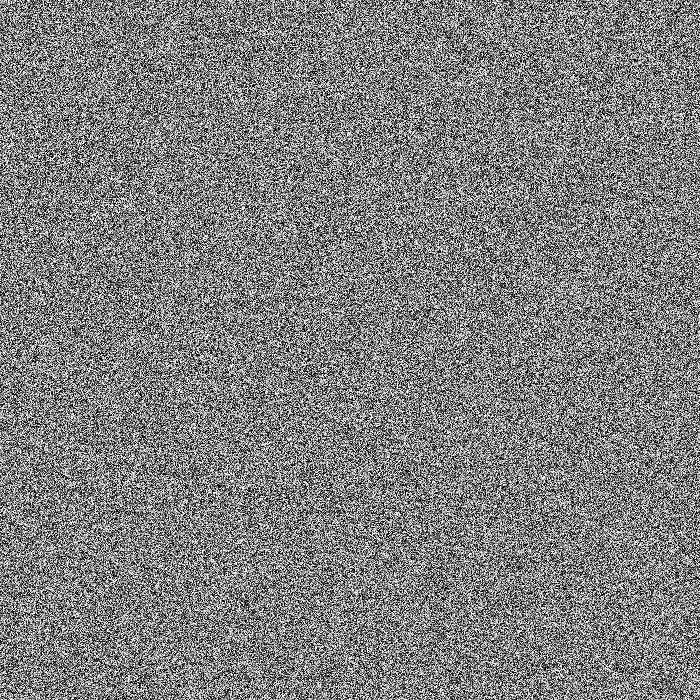
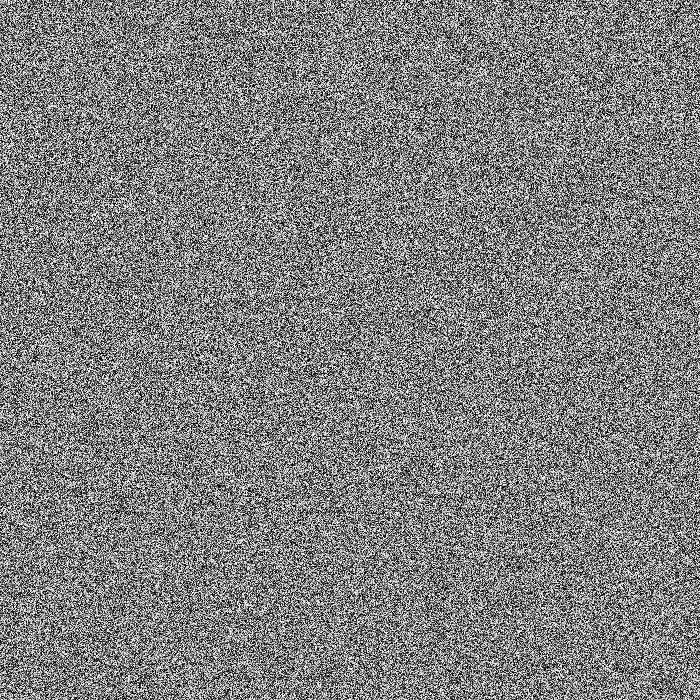
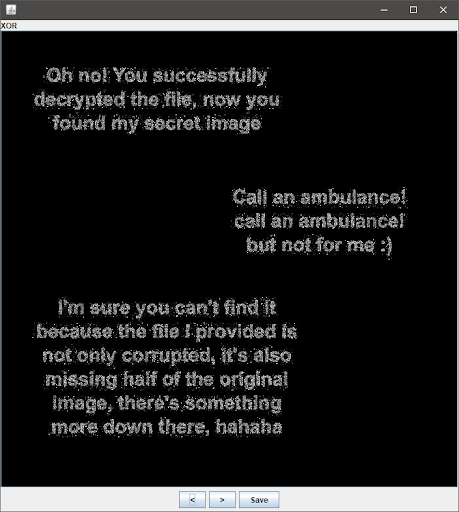
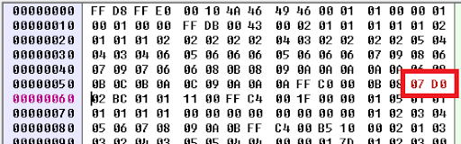
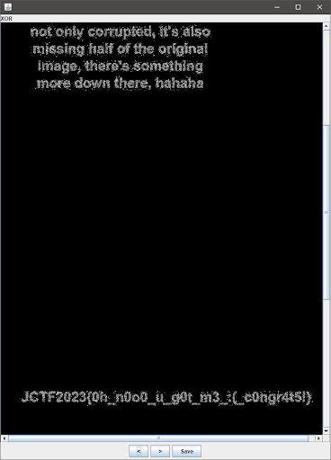

# Strange Message

Diberikan file flag.flag. Kalau di baca hexdump nya, terlihat seperti file JPG tetapi headernya ada sedikit rusak, harusnya 0xffd8 tapi jadi 0xffd7. Tetapi setelah dilihat di hex editor, ternyata ada file JPG lagi dibawahnya. Jadi kita coba pisahkan dulu, lalu perbaiki headernya sama seperti sebelumnya. Hasilnya 2 gambar serupa, kita coba XOR menggunakan stegsolve.

Given a file `flag.flag`. If we read the hexdump, it looks like a JPG file but the header is slightly corrupted, it should be `0xffd8` but it is `0xffd7`.

After some times, we realized that there is another JPG file embedded. So we try to separate the two JPGs and fix the header with the same way as before. The result is two similar images, and we attempt to XOR them using stegsolve.

  

Ah there is something down there... Let's change the size. Here we change it to 700x200.

 

```
JCTF2023{0h_n0o0_u_g0t_m3_:(_c0ngr4t5!}
```