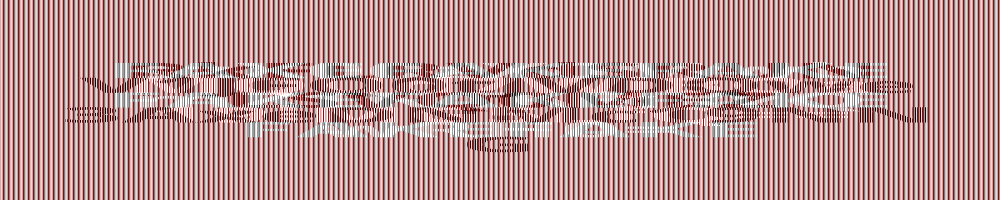
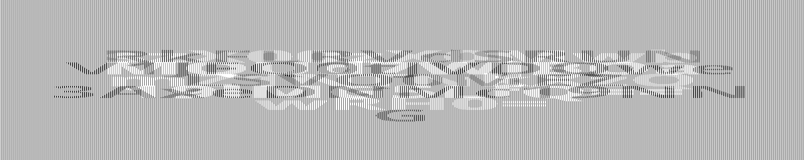
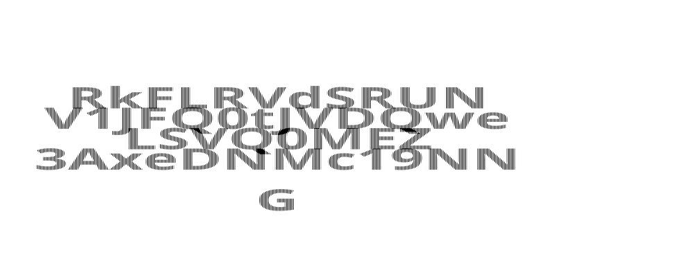
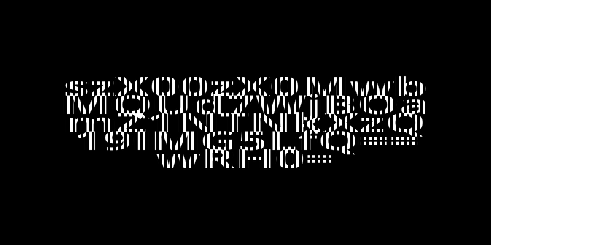

# Mixxedup

Given a file `c.jpg`. First, I ran binwalk and found file `dobleh.txt` and `flag.png`.



I tried to use photoshop to separate the red color. 




The red one only has FAKE FAKE FAKE FAKE FAKE FAKE, while the grayscale one seems to has base64 letters. I can tell from the last line of the white text, it ends with `=`.

I tried to separate the interlacing black and white text using script

```py
from PIL import Image


img = Image.open('byered.png')


width, height = img.size
byered = Image.new('RGBA', (width//2, height))


w = 0
for x in range(width):
    column = img.crop((x, 0, x+1, height))
    if column.getpixel((0, 0)) == (255, 255, 255, 255):
    # if column.getpixel((0, 0)) != (255, 255, 255, 255):
        byered.paste(column, (w, 0))
        w += 1


byered.save('byeblack.png')
# byered.save('byewhite.png')
```

The result is shown below



Now this is the part I hate the most. The text is not ordered, so I tried one by one decoding it from base64 until I got the flag.

```
byeblack:
RkFLRVdSRUN
V1JFQ0tJVDQwe
LSVQ0MEZ
3AxeDNMc19NN
G

byewhite:
szX00zX0Mwb
MOUd7WjBOa
mZ1NTNkXzQ
19IMG5LfQ==
wRH0=

V1JFQ0tJVDQwe 3AxeDNMc19NN G szX00zX0Mwb mZ1NTNkXzQ wRH0=
WRECKIT40{p1x3Ls_M4k3_M3_C0nfu53d_40D} [v]

RkFLRVdSRUN LSVQ0MEZ MOUd7WjBOa 19IMG5LfQ==
FAKEWRECKIT40FL9G{Z0Nk_H0nK} [x]
```

Then the flag is
```
WRECKIT40{p1x3Ls_M4k3_M3_C0nfu53d_40D}
```